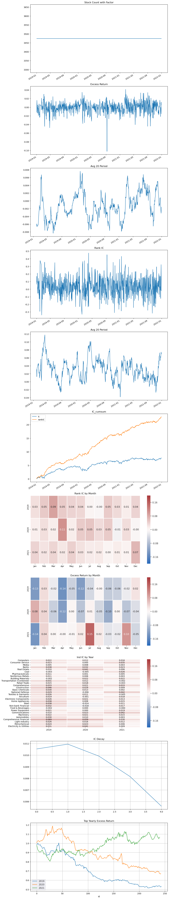

# 因子评价和展示模块代码
### 代码所需要导入的库
```python
from signal2weights import *
from transmatrix.matrix.signal.base import BaseEvaluator
import matplotlib.pyplot as plt
import multiprocessing as mp
```

## 调用模块及其相关函数   
```python
class Eval(BaseEvaluator):  #这块后续再改，不太知道那个咋调用的
```

### critic - 获取因子数据
```python
def critic(self, critic_data):  #获取因子数据
    perf = {}
    perf.update(self._process_base(critic_data))
    #更新字典键值，即给perf传入critic-data
    stats = perf['stats']
    stats.update(self._process_500(critic_data))
    stats = pd.DataFrame(pd.Series(stats, name = 'VALUE'))
    stats.index.name = 'FIELD'
    perf['stats'] = stats

    perf.update(self._process_ind(critic_data))
    self.perf = perf
    return perf
```

### _process_500 - 构建与基准组合中证500
### 输出DataFrame内容

>| 名称       | 含义                 |
>|----------|--------------------|
| ICMean_500 | 以中证500为全样本的组合的信息系数 |
| ICIR_500 | 以中证500为全样本的组合的信息比率 |

* 输出样例


```python
def _process_500(self, critic_data):
    #应该是中证500
    stats = {}
    price = critic_data['close']   #收盘价
    factor = critic_data['signal']  #信号
    universe = critic_data['is_500']

    price = keep_universe(price, universe)   #因子池中有的（此处应为500）
    factor = keep_universe(factor, universe)
    
    ret_1d = price.shift(-1) / price - 1 # 建议落地，否则最后1天 是nan。  #得到收益率
    ic_1d, ir_1d = vec_rankICIR(factor, ret_1d)    #计算每个因子的IR
    stats['ICMean_500'] = ic_1d
    stats['ICIR_500'] = ir_1d

    return stats
```

### _process_ind - 构建行业样本并返回样本投资数据
### 输出DataFrame内容

>| 名称       |含义|
>|----------|---|
| IC       |行业内的组合信息系数|
| ICIR_500 |行业内的组合信息比率|

* 输出样例


```python
def _process_ind(self, critic_data):
    price  = critic_data['close']
    ret_1d = price.shift(-1) / price - 1
    factor = critic_data['signal']
    ind_info = critic_data['industry1'].iloc[0].to_dict()
    bins = {x:[] for x in list(set(ind_info.values()))}
    for code, ind in ind_info.items(): bins[ind].append(code)
    args = {k: (factor[v], ret_1d[v]) for k,v in bins.items()}
    pool = mp.Pool()
    stats = pool.starmap(vec_rankICIR, args.values())
    pool.close();pool.join()
    return {'industryIC':pd.DataFrame(dict(zip(args,stats)), index =['IC', 'IR']).T}
```

### _process_base - 构建与基准组合中证500   
>| 名称         |含义|
>|------------|---|
| TopRetTol  |Top组的累积收益率|
| TopRetYL   |Top组的平均年收益率|
| TopSharpYL |Top组的年化夏普比率|
| TopMdd     |Top组的最大回撤|
| LRetTol    |LongShort组合累积收益率|
| LSRetYL    |LongShort组合年化收益率|
| ICMean     |行业内的组合信息系数|
| ICIR       |行业内的组合信息比率|

* 输出样例


```python
def _process_base(self, critic_data):
    """
    long-short
    """
    stats = {'Factor': 'reverse'}
    price = critic_data['close']
    factor = critic_data['signal']
    time_mult = len(price) / 250   #一年250个交易日吧？
    stats['dates'] = f'{price.index[0].date()} ~ {price.index[-1].date()}'
    ret_1d = price.shift(-1) / price - 1 # 建议落地，否则最后1天 是nan。
    ic_1d, ir_1d = vec_rankICIR(factor, ret_1d)
    stats['ICMean'] = ic_1d
    stats['ICIR'] = ir_1d
    sers = {}

    ascending = False if ic_1d >= 0 else True   #如果是正相关，则降序，反之升序
    topw = vec_top_weights(factor, ascending = ascending)
    lsw = vec_longshort_weights(factor, ascending = ascending)
    qw = vec_quantile_weights(factor, ascending = ascending)
    
    top_nav, top_sharp, top_mdd, top_nav_ser, top_dd_ser = \
        vec_nav_sharp_mdd_wt_sers(topw, ret_1d)

    ls_nav, ls_sharp, ls_mdd, ls_nav_ser, ls_dd_ser = \
        vec_nav_sharp_mdd_wt_sers(lsw, ret_1d)

    stats['TopRetTol'] = top_nav - 1
    stats['TopRetYL'] = stats['TopRetTol'] / time_mult   #累积收益率->年收益率 无法理解啊这
    stats['TopSharpYL'] = top_sharp
    stats['TopMdd'] = top_mdd
    
    stats['LRetTol'] = ls_nav - 1
    stats['LSRetYL'] = stats['LRetTol'] / time_mult
    stats['LSSharpYL'] = ls_sharp
    stats['LSMdd'] = ls_mdd

    sers['top_nav_ser'] = top_nav_ser
    sers['top_dd_ser']  = top_dd_ser
    sers['ls_nav_ser']  = ls_nav_ser
    sers['ls_dd_ser']   = ls_dd_ser

    quant_return = {}
    quant_return_ser = {}
    for k,v in qw.items():
        quant_return[k], quant_return_ser[k] = vec_nav_wt_ser(v, ret_1d)
    quant_return = pd.Series(quant_return, name = 'QuantileRet')
    quant_return_df = pd.DataFrame()
    for k,v in quant_return_ser.items():
        quant_return_df = pd.concat([quant_return_df, pd.Series(v, name = k)], axis = 1)
    quant_return_df.index = price.index
    
    perf = {'stats'  : stats, 
              'history': pd.DataFrame(sers, index = price.index),
              'qret': {
                    'tot':quant_return,
                    'history':quant_return_df
              }
    }

    return perf
```

## 因子展示函数及模板介绍
- 因子结果评价展示模块目前有4个模板（template）可供选择，不同模板都是以show()函数对结果进行输出，对于不同模板的输出结果介绍如下：

### templateA
>| 名称         | 含义         |
>|------------|------------|
| TopRetTol  | Top组的累积收益率 |
| TopRetYL   | Top组的平均年收益率 |
| TopSharpYL | Top组的年化夏普比率 |
| TopMdd     | Top组的最大回撤  |
| LSRetTol   | 多空对冲组合总收益  |
| LSRetYL    | 多空对冲组合的年化收益率 |
| ICMean     | 行业内的组合信息系数 |
| ICIR       | 行业内的组合信息比率 |

* 输出图例
  * 因子分组累积收益率
  
  * 因子分组历史累积收益率
  
  * Top组的历史收益率及回撤情况
  
  * LongShort组的历史收益率及回撤情况
  

  - 该模板show()函数代码展示：
  ```python
  def show(self):
      perf = self.perf
      print('-'*100)
      print('stats')  #关于目标因子组合的各类数据，包括Top组，多空组IC等等
      print(perf['stats'])
      print('-'*100)
      print('history')   #时序上的各项数据，包括
      print(perf['history'])
      print('-'*100)
  
      n = 4
      _, axs = plt.subplots(n,1, figsize = (8,4*n))
      perf['qret']['tot'].plot(kind = 'bar', title = 'QuantRetTot', ax = axs[0])
      perf['qret']['history'].plot(title = 'QuantRetHistory', ax = axs[1])
  
      axt = axs[2].twinx()
      ser = perf['history']['top_dd_ser']
      axt.fill_between(ser.index, 0, ser.values, color = 'r', alpha = 0.1)
  
      perf['history']['top_nav_ser'].plot(title = 'TopNavHistory', ax = axs[2])
      axs[2].legend(['Nav'])
      axt.legend(['Mdd(right)'])
  
      axt = axs[3].twinx()
      ser = perf['history']['ls_dd_ser']
      axt.fill_between(ser.index, 0, ser.values, color = 'r', alpha = 0.1)
      perf['history']['ls_nav_ser'].plot(title = 'LSNavHistory', ax = axs[3], legend = 'NAV')
      axs[3].legend(['Nav'])
      axt.legend(['Mdd(right)'])
  
      for ax in axs: ax.grid(alpha = 0.3)
      plt.tight_layout()
      plt.show()
  
      print(self.perf['industryIC'])
  ```

### templateB
- 考虑交易成本和整手交易限制

```python
eval.show()
```  
- 输出结果及图例
<div align=center>

</div>
<div align=center>ic分析和收益分析结果展示2</div>

### templateC
- 因子加权组合分析
```python
eval.show()
```
- 输出结果及图例
<div align=center>

</div>
<div align=center>因子加权组合分析结果展示</div>

### templateD
- 输出结果
```
                      IC_Mean    IC_Std      ICIR  RKIC_Mean  RKIC_Std    RKICIR
2019-12-31 00:00:00  0.017947  0.098816  0.181621   0.034889  0.111846  0.311935
2020-12-31 00:00:00  0.006540  0.126423  0.051733   0.032513  0.136405  0.238352
2021-12-31 00:00:00  0.007475  0.113170  0.066055   0.027007  0.129344  0.208796
All                  0.010677  0.113309  0.094232   0.031486  0.126130  0.249634
```
- 输出图例
<div align=center>

</div>
<div align=center>ic分析和收益分析结果展示3</div>